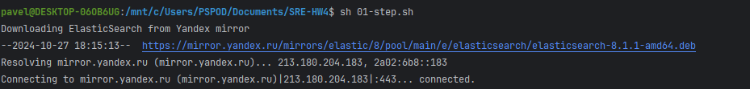

## Установка Elasticsearch + kibana

### 1. Выполните шаги из файла 01.step.sh
```shell
#!/bin/bash

echo "Downloading ElasticSearch from Yandex mirror"
wget https://mirror.yandex.ru/mirrors/elastic/8/pool/main/e/elasticsearch/elasticsearch-8.1.1-amd64.deb -O /tmp/elasticsearch-8.1.1-amd64.deb
wget https://mirror.yandex.ru/mirrors/elastic/8/pool/main/k/kibana/kibana-8.1.1-amd64.deb -O /tmp/kibana-8.1.1-amd64.deb

# Install ElasticSearch from Yandex
echo "Installing ElasticSearch + Kibana"
dpkg -i /tmp/elasticsearch-8.1.1-amd64.deb
dpkg -i /tmp/kibana-8.1.1-amd64.deb

# Configure kibana to listen on 0.0.0.0
sed -i "s/^#server.host:.*/server.host: \"0.0.0.0\"/g" /etc/kibana/kibana.yml

# Disable xpack security for elasticsearch
sed -i "s/^xpack.security.enabled:.*/xpack.security.enabled: false/g" /etc/elasticsearch/elasticsearch.yml

# Limit memory for ES to 1Gb
echo "-Xms1g" > /etc/elasticsearch/jvm.options.d/memory-limit.options
echo "-Xmx1g" >> /etc/elasticsearch/jvm.options.d/memory-limit.options

# Force to listen on 0.0.0.0
sed -i "s/^#network.host:.*/network.host: \"0.0.0.0\"/g" /etc/elasticsearch/elasticsearch.yml

# Restart Elasticsearch & Kibana
systemctl enable elasticsearch
systemctl enable kibana

systemctl restart elasticsearch
systemctl restart kibana

read -n 1 -p "Please wait for ~5 min for elasticsearch startup"


MYIP=`ifconfig eth0 | grep "inet " | awk '{print $2;}' | head -1`

echo "## Please open http://${MYIP}:5601/"


```

Возникла проблема с запуском скрипта, ошибка решилась с запуском через sudo
По localhost:5601 видим запущеный сервис


Подождав две минуты, видим интерфейс


### 2. Примените манифест с установкой fluentd - демона, который в режиме daemonset будет запускаться на всех хостах кластера kubernetes, собирать и отправлять логи в elastcisearch
Предварительно запустим minikube
```shell
 kubectl apply -f 02-fluentd-daemonset.yaml
```

### 3. Проверьте логи fluentd:
### 3.1. Определите название пода с fluentd и его статус:
```shell
kubectl get pods -A
```

```shell
kubectl logs fluentd-tcsp8 -n kube-system
```

### 4. Теперь пора настраивать kibana, для этого переходите по адресу вашей вирутальной машины: `http://VM_IP_ADDRESS:5601/app/management/kibana/dataViews` для создания DataView, в поле "name" укажите "logstash-*" и нажмите на "Create DataView"
Переходим по http://localhost:5601/app/management/kibana/dataViews 

Не получается подключится к elastic,  перезагружал minikube, и elastic, kibana.
Менял конфигурацию исходя из minikube ip. Настраивал port-forwarding. Запустить не удалось.
Делал все локально через wsl(ubuntu)
